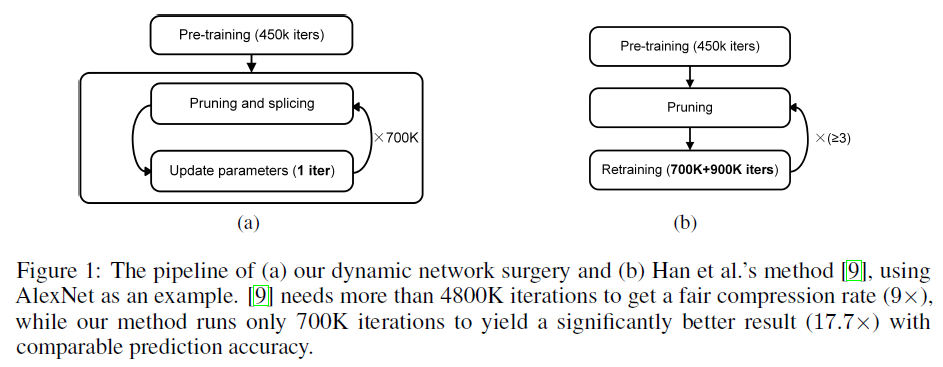
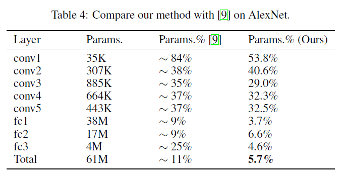

## Abstract

- Dynamic Network Surgery: making on-the-fly connection pruning
- incorporate connection splicing into the whole process to avoid incorrect pruning and make it as a continual network maintenance
- compress the number of parameters: LeNet-5, 108x; AlexNet, 17.7x; without any accuracy loss
- open-source code [[github](https://github.com/yiwenguo/Dynamic-Network-Surgery)]

## 摘要

- Dynamic Network Surgery： 实时地裁剪连接
- 整个过程中结合连接拼接的功能，避免错误的裁剪
- 压缩参数的数量：LeNet-5，108x；AlexNet，17.7x；没有任何精度损失
- 开源代码 [[github](https://github.com/yiwenguo/Dynamic-Network-Surgery)]

## 主要贡献

- dynamic network surgery: by means of continual network maintenance
- two key operations: pruning and splicing
	- better approach the compression limit
	- improve the leaning efficiency

## Dynamic Network Surgery

## Experiments and Results

- LeNet-5: 0.91% -> 0.91%; 431K -> 4.0K; 108x
- LeNet-300-100: 2.28% -> 1.99%; 267K -> 4.8K; 56x
- AlexNet: 43.42% -> 43.09%; 61M -> 3.45M; 17.7x

