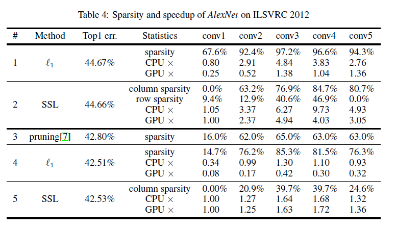

## Abstract

- a Structured Sparsity Learning (SSL) method to regularize the structures (i.e., filters, channels, filter shapes, and layer depth) of DNNs.
	- learn a compact structure from a bigger DNN to reduce computation cost
	- obtain a hardware-friendly structured sparsity of DNN to efficientily accelerate the DNN's evaluation
		- 5.1x and 3.1x speedups of convolutional layer computation of AlexNet against CPU and GPU, with off-the-shelf libraries
	- regularize the DNN structure to improve classification accuracy
		- reduce 20 layers of a Deep Residual Network (ResNet) to 18 layers while improve the accuracy from 91.25% to 92.60%
		- AlexNet, reduces the error by ~1%
- open-source code base of caffe [[github](https://github.com/wenwei202/caffe/tree/scnn)]

## 摘要

- 结构化稀疏学习（SSL）方法来正规化DNN的结构（例如，filters，channels，filter shapes， layer depth）
	- 从一个大的DNN学习一个紧凑的结构，以减少计算开销
	- 可以获得一个具有硬件友好的结构化的稀疏模式的DNN，从而可以高效地加速DNN的评测
		- 在CPU和GPU上，卷积网络分别能获得5.1x和3.1x的加速，使用现成的库
	- 正规化DNN可以改进分类错误率
		- 20层的ResNet减少到18层，分类精度从91.25%改进到92.60%
		- AlexNet可以减少约1%的错误率
- 基于caffe的开源代码实现 [[github](https://github.com/wenwei202/caffe/tree/scnn)]

## 主要贡献

- Structured Sparsity Learning (SSL), can directly learn a compressed structure of deep CNNs by group Lasso regularization
	- SSL使用分组Lasso正则，可以直接学习一个压缩深度CNN网络结构

## Structured Sparisity Learning Method for DNNs

## Experiments and Results

- Intel Xeon E5-2630 CPU单线程; GeForce GTX TITAN Black

- 模型预测加速明显
- 模型压缩效果有限

